Crack Detection in Pipes Using Deep 

Learning 

Atharva Deopujari 

BTECH (Electronics and Communication Engineering) 3rd Year Indian Institute of Information Technology, Nagpur 

Report Submitted on 
Completion of Practical Training at SECTD-BARC 

January 2025 

Table of Contents

Contents ................................................................................................................................................. i List of Figures ....................................................................................................................................... ii List of Tables ......................................................................................................................................... ii Synopsis ................................................................................................................................................. iii 

1. Introduction .................................................................................................................................... 1 
1. Problem Statement ........................................................................................................................... 1 
1. Motivation ....................................................................................................................................................................... 1 
2. Literature Review ........................................................................................................................... 2 
1. Naïve approach for semantic segmentation ..................................................................................... 3 
1. Fully Convolutional Networks ..................................................................................................................................... 3 
1. Mask R-CNN ................................................................................................................................................................. 3 
1. U-Net ............................................................................................................................................................................... 4 
3. Implementation ............................................................................................................................... 5 
1. Data Preparation ............................................................................................................................ 5 
1. Creating Labelled Input ........................................................................................................................................... 5 
1. Creating Input Pipeline ............................................................................................................................................ 9 
2. Network Architecture.....................................................................................................................  13 
1. Activation Functions ....................................................................................................................  15 
1. Parameters ..................................................................................................................................  16 
3. Training Experiment ......................................................................................................................  17 
1. Training Scheme .........................................................................................................................  17 
1. Optimizer ...................................................................................................................................  18 
1. Metrics .......................................................................................................................................  19 
1. Loss Functions ............................................................................................................................  20 
1. Loss Functions Comparison ..........................................................................................................  24 
1. Batch Size...................................................................................................................................  26 
1. Learning Rate ..............................................................................................................................  26 
4. Discussion and Conclusion    ........................................................................................................  27 

4\.1 Challenges Faced ...............................................................................................................................  26 

4\.1 Conclusion ........................................................................................................................................  27 

5. Future Work    ..............................................................................................................................  28 References   ..........................................................................................................................................  30 

List of Figures 

Figure 1: Semantic Segmentation ........................................................................................................... 2 Figure 2: Flood Fill................................................................................................................................. 6 Figure 3: Draw ROI ................................................................................................................................ 6 Figure 4: Active Contours ...................................................................................................................... 7 Figure 5: Morphology ............................................................................................................................ 8 Figure 6: Secondary Cracks ................................................................................................................... 8 Figure 7: Dataset Comparision ............................................................................................................... 9 Figure 8: Data Augmentation ............................................................................................................... 10 Figure 9: Data Preparation Input Pipeline ............................................................................................ 12 Figure 10: Network Architecture .......................................................................................................... 15 Figure 11: Loss and mIoU Curve of BCE Loss ................................................................................... 19 Figure 12: Loss and mIoU Curve of Dice Loss ................................................................................... 20 Figure 13: Loss and mIoU Curve of Focal Loss .................................................................................. 21 Figure 14: Loss and mIoU Curve of Tversky Loss .............................................................................. 22 Figure 15: Comparison of Different Models ........................................................................................ 25 

List of Tables 

Table 1: Metrics Comparison Table…………………………………………………………………….22 

Synopsis 

Traditional methods for identifying cracks and damages in pipelines often face challenges, including limited accuracy and reliability. Ensuring the structural integrity of pipelines is critical,  as  cracks  can  develop  due  to  various  operational  and  environmental  factors, necessitating precise and thorough inspections. Advancements in deep learning and image processing now enable the application of Neural Networks to streamline and optimize the crack detection process. 

This project aims to develop a deep learning model for crack tip detection in pipelines using images  obtained  through  destructive  testing.  Semantic  Segmentation  techniques  were employed to address the problem, with the U-Net architecture forming the foundation of the model. The dataset used for training comprised diverse crack types, varying levels of severity, and  real-world  conditions.  A  robust  training  pipeline  was  implemented,  incorporating validation steps and iterative optimization. Data augmentation techniques were applied to enhance the model’s performance. 

The project also involved experimenting with multiple loss functions, including Binary Cross- Entropy, Dice Loss, Tversky Loss and Focal Loss, to determine the most suitable approach for this task. Based on the analysis, a recommendation for the optimal loss function has been made, ensuring higher accuracy and efficiency in crack detection. 

This model has the potential to significantly enhance the reliability and precision of pipeline inspections, addressing challenges such as complex crack patterns, lighting variations, and camera  movements. By leveraging  deep  learning,  this  approach  paves  the  way  for more efficient and accurate inspection methods in critical infrastructure monitoring. 

iv 

1\. Introduction 

1. Problem Statement 

Pipelines play a critical role in industries such as oil and gas, water supply, and chemical processing. However, they are prone to cracks that can emerge due to various environmental and operational factors, necessitating rigorous inspections. Traditional inspection methods, including destructive testing, provide valuable insights but come with inherent challenges, such as inefficiency, high costs, and potential inaccuracies. 

Deep learning offers a promising solution by enhancing the precision and efficiency of crack detection through image analysis. This project aims to develop a robust deep learning model specifically for crack tip detection in pipelines using images obtained through destructive testing. The dataset utilized includes diverse crack types, varying severity levels, and real- world conditions to ensure the model’s adaptability and accuracy. 

Challenges: 

1. Complex Crack Patterns from Destructive Testing: Cracks generated during destructive testing can exhibit intricate patterns, making it challenging to distinguish genuine crack features from testing-induced artifacts. The model must effectively address these complexities for accurate detection. 
1. Varying Lighting Conditions: Inspection images are often captured under inconsistent lighting, which can affect the visibility of cracks. A robust model capable of maintaining consistent performance across diverse lighting scenarios is essential. 
1. Limited Availability of Destructive Testing Data:

   Due to the high costs and risks of destructive testing, the availability of relevant data is often limited. Effective strategies, such as data augmentation, are necessary to train a reliable model despite this constraint. 

2. Motivation 

The development of a deep learning model for crack tip detection holds immense potential for improving the reliability of pipeline inspections. By enhancing detection accuracy and efficiency, this approach can address challenges posed by traditional methods. 

Crack patterns generated during destructive testing are often too complex to describe mathematically, necessitating a learning-based approach that enables the model to extract meaningful features directly from the data. Moreover, the model must be capable of handling additional complexities, such as variations in lighting and camera movement, to ensure robust performance across diverse scenarios. 

1 

2  Literature Review 

Image segmentation involves dividing an image into distinct regions, typically based on pixel characteristics. Unlike image classification or object recognition, it doesn't require prior knowledge of specific objects. Object classification assigns predefined labels like "horse" or "car," whereas image segmentation focuses on grouping pixels. 

There are two primary types of image segmentation: semantic segmentation and instance segmentation. Semantic segmentation assigns a single class label to all objects of the same type, while instance segmentation provides separate labels for similar objects. 

Semantic segmentation involves breaking down an unfamiliar image into different parts and identifying objects within it, such as a beach, ocean, sun, dog, or swimmer. Unlike object  recognition,  segmentation  goes  deeper  and  doesn't  require  recognizing  objects beforehand. It assigns a category label to each pixel in the image, offering detailed category information at the pixel level. 

This pixel-level semantic information is crucial for various real-world applications like self-driving vehicles, pedestrian detection, defect identification, therapy planning, and computer-aided diagnosis. It enables intelligent systems to understand spatial positions and make important judgments. Semantic segmentation stands out from other computer vision tasks, like object classification, which requires annotating the entire image with one or more labels, and object detection, which demands knowledge of where target objects are in the scene. 

When presented  with  a  new  image, an  image  segmentation algorithm is  expected  to identify and group together the pixels that share semantic relevance. 

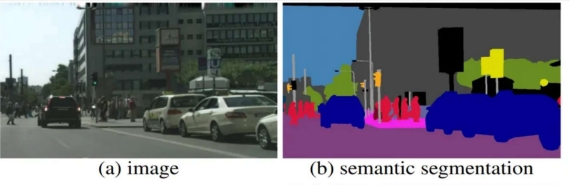

Figure 1: Semantic Segmentation 

The issue at hand involves classifying each pixel in an image into one of several possible categories.  The  objective  is  to  input  an  image  and  generate  category  decisions  for individual pixels in the output. 

2 2 

1. Naïve approach for semantic segmentation 

A simple yet foundational approach to tackle the challenge of semantic segmentation is the Naïve Approach, which treats the problem as a classification task using a sliding window. In this method, the input image is divided into multiple fixed-size crops. Each crop is processed independently by a Convolutional Neural Network (CNN) to determine the category for the central pixel of that crop. By sliding the window across the image with dimensions such as 3 × 3 or 7 × 7, the algorithm classifies each pixel based on the localized context provided by the crop. While this method can be effective in certain cases, it has significant limitations. It is computationally inefficient because it fails to reuse shared features between overlapping patches, leading to redundant calculations. Additionally, it does not fully exploit spatial relationships in the image, which are crucial for accurate segmentation. The choice of window size further impacts performance; smaller windows may miss broader contextual information, while larger windows may fail to capture finer details, resulting in inconsistent accuracy across different image domains. 

2. Fully Convolutional Networks 

An alternative and more advanced approach is the use of Fully Convolutional Networks (FCNs) for generating pixel-level predictions across the entire image. These models utilize convolutional and max-pooling layers to progressively reduce the spatial dimensions of the input image, compressing it to 1/32nd of its original size. At this reduced resolution, class predictions are made, which are then up-sampled and refined using deconvolution layers to restore the image to its original dimensions. FCNs are distinct in their architecture as they exclude fully connected layers, making them more efficient and adaptable to inputs of varying sizes. The down-sampling process captures semantic and contextual information, while the up-sampling process focuses on recovering spatial details. Skip connections are a key feature of FCNs, allowing information to bypass intermediate layers and directly transfer from the down-sampling path to the up-sampling path. This helps retain fine- grained spatial information lost during compression and facilitates a more accurate combination of contextual and spatial features, overcoming the limitations of the naive sliding window method. 

Despite their advantages, FCNs can still face challenges, particularly when dealing with high-resolution images. Maintaining the original resolution throughout all layers in the network can lead to significant computational and memory overheads, especially during training. This makes the efficient processing of high-resolution data a critical consideration for their application. 

3. Mask R-CNN 

The Faster R-CNN algorithm is a well-established method for effective object detection. It operates in two stages: first, the Region Proposal Network (RPN) identifies potential bounding boxes for objects, and second, the Fast R-CNN module uses RoIPool to extract features from these candidate regions, performing both classification and bounding box regression. By sharing features between these stages, the algorithm achieves faster inference and higher efficiency. Building upon Faster R-CNN, Mask R-CNN introduces a third branch to generate object masks, enabling pixel-level segmentation in addition to object detection. Unlike Faster R-CNN, which only outputs class labels and bounding box coordinates, Mask R-CNN provides a detailed output for segmentation masks, requiring finer spatial information. This enhancement is made possible by incorporating Fully Convolutional Networks (FCN) into the architecture. The Mask R-CNN framework integrates object classification, localization, and semantic segmentation. For each region of interest, it assigns a segmentation mask, a class label, and a bounding box, thus extending Faster R-CNN’s capabilities. By combining the Feature Pyramid Network (FPN) and Region of Interest Align (ROIAlign), Mask R-CNN ensures accurate boundary delineation and strong performance in both object detection and instance segmentation. 

Despite its effectiveness, Mask R-CNN has limitations. The model's computational complexity and memory requirements can pose challenges during training and inference, especially for high-resolution images. It may also struggle with segmenting very small objects or heavily occluded scenes. Furthermore, acquiring sufficient annotated training data for precise segmentation can be resource-intensive, and domain-specific applications often require meticulous parameter tuning for optimal performance. 

4. U-Net 

The U-Net architecture, an advancement of the Fully Convolutional Network (FCN), is specifically designed to deliver accurate segmentations, even with limited training data. It stands out from traditional FCNs due to two key distinctions: its symmetric design and the use of concatenation in skip connections, rather than summation. This symmetry and the strategic skip connections enhance information flow and significantly increase the number of feature maps during the up-sampling process.  

U-Net comprises two main components: the contracting path and the expansive path. The contracting path is responsible for capturing contextual information, while the expansive path focuses on precise localization, ultimately generating a detailed segmentation map. The skip connections between these paths are instrumental in preserving spatial information lost during the down-sampling process, ensuring the decoder layers can accurately localize features. This architecture offers several advantages for image segmentation tasks. Its U-shaped structure effectively integrates low-level spatial details with high-level contextual information, improving object localization. The skip connections ensure that spatial information is retained, enabling precise segmentation. Additionally, U-Net is computationally efficient, with relatively few parameters compared to other segmentation architectures. 

In this project, the U-Net architecture was employed to tackle the challenge of crack tip detection in pipelines. Its ability to handle complex patterns and retain fine-grained spatial details made it an ideal choice for accurately identifying crack tips. U-Net's effectiveness in achieving high accuracy with limited training data proved invaluable, particularly given the constraints of destructive testing data availability. By leveraging its unique features, the project achieved significant advancements in crack tip detection, enhancing both accuracy and efficiency. 

3 Implementation 

1. Data Preparation 

Data pre-processing involves the crucial task of preparing raw data to make it suitable for a deep learning model. This initial step is pivotal, as the quality of the data directly influences the quality of the model. 

For the scope of the project, data preparation encompasses two essential steps. Firstly, it involves preparing the labelled dataset. Additionally, the data is processed through an input pipeline as part of the overall data preparation process. 

1. Creating Labelled Input 

To prepare the labelled dataset, it is necessary to have a segmented mask for each image within the training data. This mask distinguishes the crack from the background by highlighting the relevant area, where the crack is represented by 1𝑠 and the background by 0𝑠 in binary form. 

The Image Segmenter tool in MATLAB was utilized for creating the segmentation mask for each image. This tool incorporates various automatic algorithms that facilitate the effective generation of segmentation masks. 

Image segmentation involves dividing an image into distinct parts or regions based on pixel characteristics. For instance, one approach is to identify regions by detecting abrupt  discontinuities  in  pixel  values,  indicating  edges  that  define  these  regions. Alternatively, methods may use colour values or texture to divide the image into regions. 

The Image Segmenter accomplishes image segmentation by refining these regions. Algorithms utilized to create the segmentation masks include: 

1. Flood Fill: 

Flood  fill  is  a  fundamental  technique  employed  in  image  segmentation, particularly for applications like creating binary masks for a given image. The primary objective of flood fill is to identify and isolate distinct regions of interest within an image. Flood fill is advantageous in scenarios where regions of interest are characterized by homogenous intensity levels. Its application facilitates the automatic and efficient segmentation of images. 

Flood Fill was used to identify and capture fully connected, visibly discernible cracks characterized by continuous  regions  and  distinct intensity levels.  This method proved highly effective in generating binary masks for images that had extensive cracks that were precisely outlined. 

 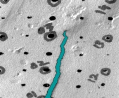

(a)  (b) 

Figure 2: Flood Fill 

Fig 2 (a), shows the image before flood fill, and Fig 2 (b), shows image after flood fill in Image Segmenter. 

2. Draw ROIs: 

The Region of Interest (ROI) drawing tool in image segmentation, allows users to define specific areas for analysis or manipulation. This tool is particularly useful for selecting regions within an image that are of particular interest for further processing or creating masks. Using Draw ROI different shapes can be drawn or plotted like rectangles, polygons, or even freehand regions onto the displayed image. These drawn ROIs serve as masks or selections enabling easy analysis. 

Draw ROI was employed in this particular use case to tackle problems of unclear images  and cracks  that  were  unevenly shaped  or  positioned  for the  Flood  Fill algorithm to identify or create masks. 

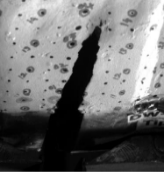  

(a)  (b)  (c) 

Figure 3: Draw ROI 

Fig  3  (a),  shows  the  image  before  ROI,  and  Fig  3  (b)  shows  the  drawn boundaries for the mask using Draw ROI, and Fig 3 (c) shows the applied mask on the image in Image Segmenter. 

3. Active Contours: 

The active contours method is an automatic and iterative technique for marking locations in an image. Active contours operate based on minimizing an energy function that defines the contour's position, adapting to image features such as edges or intensity gradients. A contour can be initiated near the object of interest, and the algorithm iteratively evolves the contour to align with prominent features in the image. This process allows for precise and fine-tuned adjustments to capture the desired object boundaries accurately. The Active Contours tool is particularly beneficial when dealing with complex object shapes or when precise boundary delineation is essential. 

The Active Contour algorithm was utilized for refining the segmentation results by addressing gaps and making minor adjustments between manually drawn or selected regions of interest and the actual boundaries of cracks. 

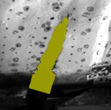 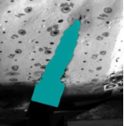 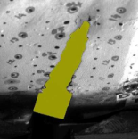

(a)  (b)  (c) 

Figure 4: Active Contours 

Fig 4 (a), shows the masked image after Draw ROI, Fig 4 (b), shows the expanded region based active contour on the image, and Fig 3 (c) shows the applied mask on the image in Image Segmenter. 

4. Morphology: 

The Morphology tool is a primary tool in image segmentation applications, offering powerful  operations  for  analysing  and  manipulating  the  shape  and structure of objects within images. Morphology encompasses a wide range of image  processing  techniques  that  operate  based  on  shapes.  During  a morphological operation, each pixel's adjustment depends on the values of the neighbouring  pixels.  Morphological  operations,  such  as  dilation,  erosion, opening, and closing, are commonly applied to enhance or suppress certain features, refine object boundaries, and extract relevant information.The erosion operation of morphology was used to modify the shape and structure of the object. It was employed to define shapes, and refine and fine-tune the segment  mask boundaries.  The  erode  morphological  operation  was  used  to 

eliminate pixels at the object boundaries. This operation proved to be beneficial in closely fitting the mask to the crack boundaries, followed by active contours. 

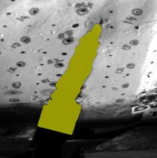 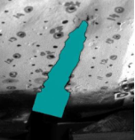 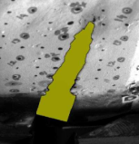

(a)  (b)  (c) 

Figure 5: Morphology 

Fig 5 (a) shows the masked image after active contour, Fig 5 (b) shows the erode mask morphology on the image, and Fig (c) shows the applied mask on the image in Image Segmenter. 

These multiple segmentation methods offered by Image Segmenter were used in an iterative process to generate highly precise segmentation masks for each image. Several methods were layered to achieve the desired results. 

Additionally, the app allows users to view the binary image of the created mask, making it easier to analyse and understand as it represents the intended output. 

Regarding the objective of the project, the segmentation mask for each image comprises of two parts: the primary crack, including the tip of the crack and the secondary cracks. 

Flood fill and Draw ROIs are the two algorithms utilized to mask the secondary cracks in the images. 

 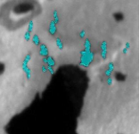 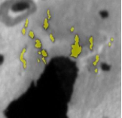

(a)  (b)  (c) 

Figure 6: Secondary Cracks 

Fig 6 (a) shows the image before masking, Fig 6 (b) shows the drawn boundaries for the mask using Draw ROI, and Fig 6 (c) shows the applied mask on the image in Image Segmenter. 

2. Creating Input Pipeline

The pipeline handles datasets from two different sources containing image-mask pairs: one consisting of 1,612 training samples and 403 validation samples after splitting. To ensure optimal learning from both datasets, the pipeline incorporates several preprocessing steps and data augmentation techniques. The dataset is configured to repeat indefinitely during training,  allowing  the  model  to  train  over  multiple  epochs  without  manual  dataset reinitialization. 

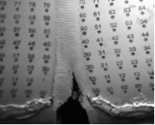 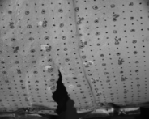

(a)  (b) 

`                                             `Figure 7: Dataset Comparison 

`      `Fig 7 (a) shows image from new dataset, Fig 7 (b) shows image from old dataset. 

Pipeline Operations: 

1. Data Loading and Preprocessing:
- Images  and  masks  are  loaded  from  their  respective  directories  using TensorFlow's file reading operations 
- Images are decoded from PNG format and normalized to float32 values in the range [0,1] 
- Masks undergo binary conversion and one-hot encoding into two classes 
- Mixed precision (float16) is implemented to optimize memory usage and potentially improve training speed 
2. Data Augmentation:  
- Random horizontal and vertical flipping with 50% probability for each transformation 
- Consistent resizing of images and masks to 512x640 pixels (reduced from 2048x2560) 
- These augmentations help improve model robustness and generalization by introducing variability in the training data 

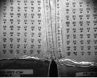 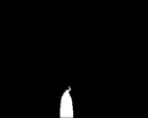

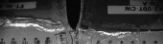 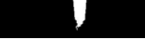

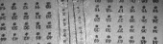 ![ref1]

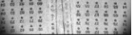 ![ref1]

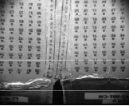 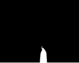

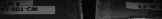 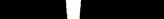

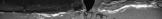 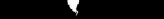

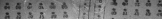 ![ref2]

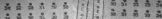 ![ref2]

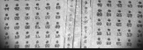 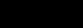

(a)                                                             (b) 

Figure 8: Data Augmentation 

Fig 8 (a) shows the original and its augmentations for the input image, Fig 8 (b) shows the original and its augmentations for the mask image. 

3. Shuffling:  
- Implemented with a large buffer size of 2500 to ensure thorough mixing of samples 
- Helps prevent the model from learning dataset-specific patterns 
  1. Ensures balanced representation from both datasets during training 
  1. Reduces bias in the learning process by randomizing the order of samples 
4. Dataset Organization:  
   1. Images and masks are paired using TensorFlow's Dataset API 
   1. The combined dataset is shuffled with a buffer size of 2500 to ensure random sampling 
   1. An 80-20 split is applied to create training and validation sets 
   1. Parallel processing is implemented through efficient data loading 
4. Batching and Prefetching:  
   1. Data  is  organized  into  batches  for  efficient  parallel  processing  during training 
   1. Prefetching  is  implemented  to  overlap  data  preprocessing  and  model execution 
   1. These optimizations help maximize GPU utilization and reduce training time 
   1. Ensures the input pipeline doesn't become a bottleneck during training 

To enhance the size and feature variance of the dataset, each image is repeated 4 times using the repeat method, which duplicates tensors a specified number of times in the dataset. 

By integrating these operations, the input pipeline creates a streamlined data flow that optimizes the training process. The implementation of data augmentation, shuffling, and efficient batching helps prevent overfitting and enables the model to learn from a diverse range of examples. Prefetching ensures efficient memory usage and fast data processing, which are crucial for training deep learning models on large image datasets. 

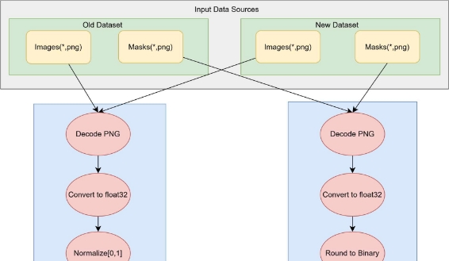

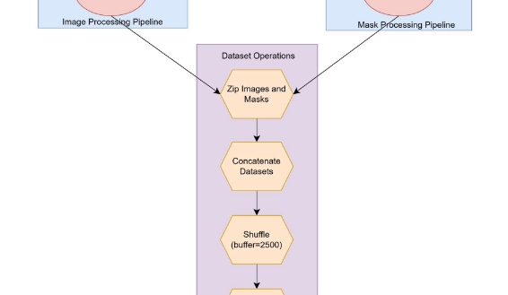

Figure 9: Data Preparation Input Pipeline 

2. Network Architecture 

The implemented U-Net architecture is a convolutional neural network designed for image processing tasks, featuring a symmetric encoder-decoder structure with skip connections. The network accepts grayscale images of flexible dimensions as input and produces single- channel output images with the same spatial dimensions. 

1) Encoder Path (Contracting Path) 

The encoder consists of three main blocks, each progressively reducing spatial dimensions while increasing feature complexity: 

1. Initial Block  
   1. Two consecutive 3×3 convolutional layers with 64 filters 
   1. ReLU activation functions 
   1. 2×2 max pooling for downsampling 
1. Second Block  
   1. Two 3×3 convolutional layers with 64 filters 
   1. ReLU activation functions 
   1. 2×2 max pooling for downsampling 
1. Bottom Block  
- Two 3×3 convolutional layers with 128 filters 
- ReLU activation functions 
- 2×2 max pooling for downsampling 
2) Bridge Section 

The bridge between encoder and decoder consists of: 

- 3×3 convolutional layer with 256 filters 
- 3×3 convolutional layer with 128 filters Both layers use ReLU activation functions 
3) Decoder Path (Expanding Path) 

The decoder mirrors the encoder structure with three main blocks, each incorporating skip connections: 

1. First Upsampling Block  
- 3×3 transposed convolution with 128 filters and stride 2 
- Skip connection concatenation from the corresponding encoder level 
- Two 3×3 convolutional layers (128 and 64 filters) 
  2. Second Upsampling Block  
     1. 3×3 transposed convolution with 64 filters and stride 2 
     1. Skip connection concatenation 
     1. Two 3×3 convolutional layers with 64 filters 
  2. Final Upsampling Block  
     1. 3×3 transposed convolution with 64 filters and stride 2 
     1. Skip connection concatenation 
     1. Two 3×3 convolutional layers with 64 filters 
4) Output Layer 
- 3×3 convolutional layer with single filter 
- Sigmoid activation function 
- Produces final output in float32 precision 

Technical Implementation Details 

- The model implements mixed precision training using float16 
- All convolutional layers (except the final one) use ReLU activation 
- Skip connections are implemented using concatenation operations 
- The architecture maintains symmetry between encoder and decoder paths 
- The model can handle variable input dimensions through dynamic sizing 

Memory Management Features 

- Progressive downsampling in the encoder reduces memory requirements 
- Skip connections preserve high-resolution features while maintaining memory efficiency 
- The use of mixed precision training optimizes memory usage and computational speed 

Distinctive Features 

1. Flexible input dimensions (None × None × 1) 
1. Consistent filter sizes (3×3) throughout the network 
1. Symmetric filter counts in corresponding encoder-decoder layers 
1. Mixed precision implementation for optimized performance 
1. Dense skip connections for feature preservation 

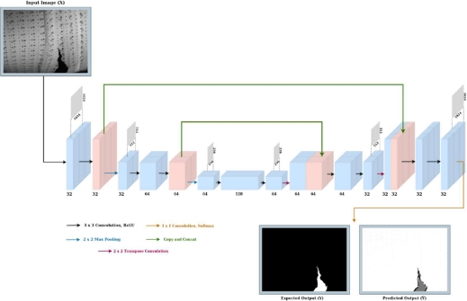

Figure 10: Network Architecture

1. Activation Functions

The U-Net architecture implements two distinct activation functions strategically placed throughout the network to facilitate effective feature learning and output generation: 

1. Rectified Linear Unit (ReLU) 
1. Sigmoid Function 
1. ReLU (Rectified Linear Unit) 
- Used in all convolutional layers except the output 
- Function: f(x) = max (0, x) 
- Benefits:  
  - Prevents vanishing gradient problem 
  - Introduces sparsity in the network 
  - Computationally efficient 
2. Sigmoid 
- Used only in the final output layer 
- Function: σ(x) = 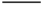
- Purpose:  
  - Maps output to [0,1] range 
  - Suitable for image pixel intensity prediction 
  - Ensures smooth transitions in output values 
2. Parameters

The U-Net architecture consists of 24 layers with a total of 1,735,361 trainable parameters. The network is designed to handle variable input dimensions (None × None × 1) for grayscale images. 

Layer-by-Layer Parameter Breakdown Encoder Path 

1. Initial Block  
   1. First Conv2D: 64 filters, 640 parameters 
   1. Second Conv2D: 64 filters, 36,928 parameters 
   1. MaxPooling2D: 0 parameters 
1. Second Block  
   1. First Conv2D: 64 filters, 36,928 parameters 
   1. Second Conv2D: 64 filters, 36,928 parameters 
   1. MaxPooling2D: 0 parameters 
1. Third Block  
- First Conv2D: 128 filters, 73,856 parameters 
- Second Conv2D: 128 filters, 147,584 parameters 
- MaxPooling2D: 0 parameters 

Bridge Section 

- Conv2D (256 filters): 295,168 parameters 
- Conv2D (128 filters): 295,040 parameters 

Decoder Path 

1. First Upsampling Block  
   1. Conv2DTranspose: 147,584 parameters 
   1. Concatenation: 0 parameters 
   1. Two Conv2D layers: 295,040 + 73,792 parameters 
1. Second Upsampling Block  
   1. Conv2DTranspose: 36,928 parameters 
   1. Concatenation: 0 parameters 
   1. Two Conv2D layers: 73,792 + 36,928 parameters 
1. Final Upsampling Block  
- Conv2DTranspose: 36,928 parameters 
- Concatenation: 0 parameters 
- Two Conv2D layers: 73,792 + 36,928 parameters 

Output Layer 

- Final Conv2D: 577 parameters (1 filter) 

Parameter Distribution 

- Heaviest layers: Bridge section Conv2D layers (~295K parameters each) 
- Lightweight layers: Initial Conv2D (640 parameters) and Output Conv2D (577 parameters) 
- Zero-parameter layers: MaxPooling2D and Concatenate operations 
3. Training Experiment 
1. Training Scheme 

In order to train a highly effective and efficient U-Net model for image processing tasks, careful consideration was given to the selection of optimization techniques and training strategies. The model leverages mixed-precision training using the mixedfloat16 policy to optimize computational efficiency while maintaining numerical stability. 

The Adam Optimizer was chosen for its ability to handle complex image processing tasks. Learning rate scheduling, a crucial component of the training scheme, was implemented. The learning rate boundaries were set at 60 and 90 times the training dataset cardinality, with values transitioning from 1e-4 to 1e-5, and finally to 1e-6. This schedule allows for fine- grained control over the optimization process at different stages of training. 

The adoption of mini-batch Gradient Descent with a batch size of 16 was a key aspect of the training methodology. This batch size was consistently applied across both training and validation datasets, with the implementation including prefetch buffering for optimized data pipeline performance. 

The model training is implemented within a custom training loop that runs for 120 epochs, with each iteration providing comprehensive tracking of model performance. The training loop incorporates JIT compilation for improved execution speed. 

For evaluating the model's effectiveness, a four loss functions were implemented combining Binary Cross-Entropy (BCE), Dice Loss, Focal Loss and Tversky Loss. Each loss function was used to train the model separately, allowing for a comprehensive evaluation of their effectiveness in the image segmentation task. The trained models were saved with distinct names to preserve the results from each training approach. 

The data pipeline is structured to handle images from two distinct directories, implementing data augmentation for training robustness. The training dataset is cached and repeated 4 times to ensure sufficient training iterations, while the validation dataset is cached with a single repetition. 

Performance monitoring is comprehensive, tracking multiple metrics including: 

- A custom pixel accuracy implementation that separately evaluates background and foreground accuracy and then means them. 
- Mean Intersection over Union (IOU)  
- Loss values for both training and validation phases 

The training process saves the model and stores detailed training metrics including loss, accuracy, and pixel accuracy for both training and validation sets as numpy arrays for further analysis. 

The holistic training approach combines mixed-precision training, carefully scheduled learning rates, and comprehensive metric tracking to ensure optimal model performance. The implementation focuses on both computational efficiency and training effectiveness, with particular attention to maintaining numerical stability throughout the extended 120-epoch training process. 

2. Optimizer 

Deep learning models rely on optimization algorithms during their training phase. These algorithms process batches of data, calculate gradients, and update the model's weights and biases. After training is complete, the optimized model can be used to make predictions on new data.In the field of deep neural network training, Stochastic Gradient Descent (SGD) based algorithms are the primary optimization methods. These can be categorized into two main types: 

- Algorithms that adapt their learning rates (like Adam and AdaGrad) 
- Algorithms that use acceleration techniques (like Nesterov momentum) 

Adam (Adaptive Moment Estimation) combines both first-order and second-order moment estimation in its stochastic gradient descent approach. It calculates: 

- The mean of the gradient (first-order moment) 
- The element-wise squared gradient (second-order moment) 

Both calculations use exponential moving averages with bias correction. The weight updates are then determined by scaling the first-order moment by the learning rate and dividing by the square root of the second-order moment. For our U-Net model training, we chose Adam as our optimizer because it offers several key advantages: 

- Efficient computational performance 
- Minimal memory usage 
- Resilience to gradient scaling issues 
- Excellent handling of large-scale problems with many parameters or data points 

Adam effectively combines the best aspects of several optimization algorithms, particularly incorporating beneficial features from RMSProp. In practice, it often achieves better results than alternative optimization methods while requiring less computation time. These characteristics make Adam a strong default choice for many deep learning applications, including our image processing task. 

3. Metrics 

To evaluate the performance of the crack tip detection model, two key metrics were chosen: Mean Intersection over Union (mIoU) and Mean Pixel Accuracy. These metrics are 

widely used in semantic segmentation tasks and provide complementary insights into the model's effectiveness. 

1. Mean Intersection over Union (mIoU) 

mIoU is a standard metric for evaluating the quality of segmentation models. It measures the overlap between the predicted segmentation mask and the ground truth mask, averaged across all classes. For binary segmentation tasks like crack tip detection, it evaluates how well the model captures the crack regions (foreground) and background. 

Formula: 

IoU =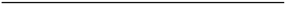

mIoU = ∑ 𝐼𝑜𝑈 Where N is the number of classes. 

Significance: 

- Provides a robust measure of the overlap between predicted and ground truth masks. 
- Penalizes false positives and false negatives equally, ensuring a balanced evaluation. 
- Suitable for tasks with class imbalance, as it evaluates each class independently before averaging. 

In this project, mIoU was chosen because it reflects the model's ability to accurately segment complex crack patterns while avoiding misclassification of the background. 

2. Mean Pixel Accuracy 

Mean Pixel Accuracy calculates the fraction of correctly classified pixels, averaged across all classes. It is a simpler metric compared to mIoU but is useful for assessing the model's overall accuracy in predicting pixel-level labels. 

Formula: 

Pixel Accuracy = 

Mean Pixel Accuracy = 1 𝑁 𝑇𝑟𝑢𝑒 𝑃𝑜𝑠𝑖𝑡𝑖𝑣𝑒𝑖

𝑁∑𝑖=1 𝑇𝑜𝑡𝑎𝑙 𝑃𝑖𝑥𝑒𝑙𝑠 𝑖𝑛 𝐶𝑙𝑎𝑠𝑠𝑖

Significance: 

- Provides a general understanding of the model's pixel-level performance. 
- Highlights overall accuracy, including both foreground and background regions. 
- Complements mIoU by focusing on individual pixel classification accuracy. 

In this project, Mean Pixel Accuracy was included as an additional metric to assess how well the model performs in identifying crack and non-crack regions across the entire dataset. 

4. Loss Functions 

Choosing the right loss function is pivotal for the success of deep learning models, particularly in semantic segmentation tasks like crack tip detection. In this project, four different loss functions were tested and analysed: Binary Cross-Entropy (BCE), Dice Loss, Focal Loss, and Tversky Loss. Each of these loss functions offers unique strengths and is suited to different aspects of the problem. Below is a detailed explanation of each, along with their relevance to the project. 

1. Binary Cross-Entropy (BCE): 

Binary Cross-Entropy is one of the most commonly used loss functions for binary classification problems, including semantic segmentation tasks where the goal is to classify each pixel as belonging to the foreground (crack) or background. BCE evaluates how well the predicted probabilities align with the ground truth, encouraging the model to output probabilities close to 1 for the correct class and 0 for the incorrect class. 

Advantages: 

- Straightforward to implement and interpret. 
- Works well for balanced datasets where foreground and background pixels are roughly equal. 

Challenges: 

- Struggles with class imbalance, as it treats all pixels equally regardless of their frequency in the dataset. 

Formula: 

BCE Loss = − 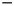∑ (𝑦.log(𝑝) + (1 −  𝑦) .log(1 − 𝑝))

Where 𝑦 is the ground truth label, 𝑝 is the predicted probability, and N is the total number of pixels. 

In this project, BCE provided a strong baseline for evaluating the segmentation performance, but its sensitivity to class imbalance motivated the exploration of alternative loss functions. 

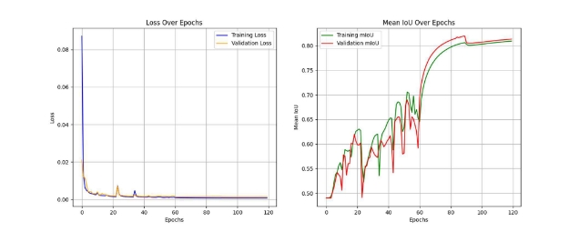

Figure 11: Loss and mIoU Curve of BCE Loss

2. Dice Loss: 

Dice Loss is particularly suited for tasks with significant class imbalance, as it directly measures the overlap between the predicted and ground truth masks. It focuses on maximizing the intersection between the two, making it ideal for crack detection where the foreground (cracks) is often much smaller than the background. 

Advantages: 

- Prioritizes regions with poor overlap, improving segmentation of smaller features like crack tips. 
- Naturally accounts for class imbalance by focusing on the ratio of correctly predicted foreground pixels. 

Challenges: 

- Can be unstable during the initial stages of training due to division by small values in the denominator. 

Formula: 

Dice Loss = 1 −   .|  ∩  |    

|  |  |  |    

Where P represents the predicted mask, G is the ground truth mask, and ϵ is a smoothing constant to avoid division by zero. 

In this project, Dice Loss was effective in improving the model’s focus on the crack regions, especially when dealing with complex patterns. 

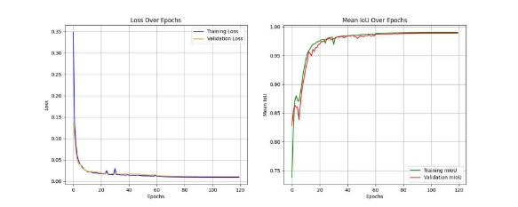

Figure 12: Loss and mIoU Curve of Dice Loss

3. Focal Loss: 

Focal Loss is designed to handle extreme class imbalance by down-weighting the loss for well-classified examples and focusing more on harder-to-classify pixels. This makes it particularly useful for datasets where the foreground is sparse compared to the background. 

Advantages: 

- Reduces the impact of easy examples, allowing the model to prioritize learning from challenging cases. 
- Well-suited for tasks with highly imbalanced classes, such as crack detection. 

Challenges: 

- Requires careful tuning of hyperparameters α (weighting factor) and γ (focusing parameter). 

Formula: 

Focal Loss = −𝛼.(1 − 𝑝) .log(𝑝)

Where 𝑝 is the predicted probability for the correct class, α adjusts the class weighting, and γ determines the focus on difficult examples. 

In this project, Focal Loss demonstrated its strength in highlighting crack tips, where the correct pixels were often outnumbered by background pixels. 

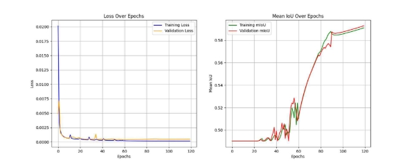

Figure 13: Loss and mIoU Curve of Focal Loss

4. Tversky Loss: 

Tversky Loss is an extension of Dice Loss, addressing its limitations by introducing two parameters, α and β, to control the weighting of false positives (FP) and false negatives (FN). This makes it highly effective for segmenting objects with imbalanced foreground and background proportions, such as crack tips in this project. 

Advantages: 

- Highly customizable to prioritize specific segmentation errors, such as penalizing false negatives more heavily for critical features. 
- Excels in cases of extreme class imbalance, making it suitable for crack tip detection. 

Challenges: 

- Requires careful tuning of α and β to achieve optimal performance. 

Formula: 

Tversky Loss = 1 − |  ∩  |    

|  ∩  |    .|    |    .|    |    

Where α and β are weighting parameters for false positives and false negatives, respectively. 

In this project, Tversky Loss proved to be particularly effective in refining segmentation accuracy, especially for intricate crack patterns and small regions. 

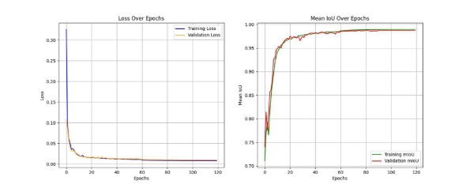

Figure 14: Loss and mIoU Curve of Tversky Loss

By experimenting with these loss functions, this project provided valuable insights into their impact on model performance. Each loss function contributed uniquely to addressing challenges such as class imbalance, complex crack patterns, and sparse foreground regions. The final analysis identified the most effective loss function for optimizing crack tip detection in pipelines. 

5. Loss Functions Comparison 

|Loss Function |Training mIoU |Validation mIoU |Train Loss |Validation Loss |Train Accuracy |Validation Accuracy |
| - | :- | :- | :- | :- | :- | :- |
|BCE Loss |0\.80943 |0\.81339 |0\.00071 |0\.00144 |0\.98991 |0\.98821 |
|Dice Loss |0\.99024 |0\.988796 |0\.00954 |0\.01109 |0\.99719 |0\.99689 |
|Focal Loss |0\.59103 |0\.59285 |0\.00015 |0\.00046 |0\.99883 |0\.99775 |
|Tversky Loss |0\.98945 |0\.98721 |0\.00787 |0\.00948 |0\.99544 |0\.99371 |

Table 1: Metrics Comparison

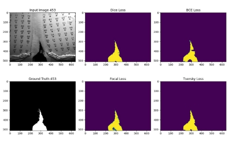

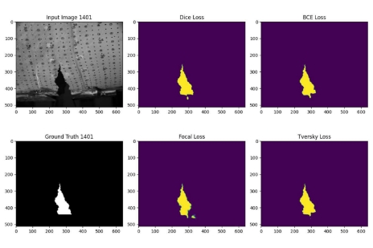

Figure 15: Comparison of different Models

The performance of the models trained using different loss functions—Binary Cross-Entropy (BCE), Dice Loss, Focal Loss, and Tversky Loss—was evaluated based on predicted output images and their corresponding metrics. Among the loss functions tested, Dice Loss demonstrated superior performance, particularly in accurately segmenting cracks. 

The analysis of the predicted outputs revealed that Dice Loss effectively handled the class imbalance between the foreground (crack regions) and background. It achieved higher overlap between the predicted masks and ground truth, resulting in visually more accurate segmentations. 

The quantitative evaluation further validated these findings, as Dice Loss produced the highest Mean Intersection over Union (mIoU) among the loss functions. This metric indicates the model's ability to capture the intricate crack patterns and achieve precise segmentation, making Dice Loss the optimal choice for this crack tip detection task. 

By selecting Dice Loss, the model achieved a balance between accuracy and generalization, providing a reliable solution for detecting cracks in pipelines. 

6. Batch Size 

In the training process, a batch size of 16 samples was selected for both training and validation phases. The batch size represents the number of samples processed in parallel before performing a model parameter update. This moderate batch size was chosen to balance multiple considerations: 

- Memory Efficiency: Processing 16 samples at once allows for efficient use of available computing resources while avoiding memory constraints 
- Training Stability: The chosen batch size provides a good compromise between training stability and convergence speed 
- Computational Performance: This batch size enables efficient parallel processing while maintaining reasonable training times 

The same batch size is maintained consistently across both training and validation steps to ensure uniform processing throughout the entire pipeline. This configuration proved effective for the model training, providing stable gradient updates and consistent learning behavior across epochs. 

7. Learning Rate 

The training implementation utilizes a piecewise constant decay learning rate schedule to optimize model convergence. This adaptive approach adjusts the learning rate throughout the training process in three distinct phases: 

1. Initial Phase: The learning rate begins at 1e-4, allowing for larger parameter updates early in training 
1. Middle Phase: At 60% through training, the rate decreases to 1e-5, enabling finer adjustments 
1. Final Phase: At 90% through training, the rate further reduces to 1e-6, allowing for precise fine-tuning 

This decreasing learning rate strategy serves several important purposes: 

- Early Progress: The higher initial rate enables rapid exploration of the parameter space and faster initial convergence 
- Stability: The step-wise reduction helps prevent overshooting optimal values as training progresses 
- Fine-Tuning: The very small final learning rate allows the model to make subtle adjustments for optimal performance 

The schedule was designed to balance the trade-off between training speed and model accuracy, ensuring efficient convergence while maintaining stable learning behavior throughout the training process. 

4. Discussion and Conclusion 
1. Challenges Faced 

During the development of the crack detection model, we encountered several key challenges: 

1. Loss Function Selection  
   1. Extensive experimentation was required to evaluate different loss functions (Binary Cross-Entropy, Dice Loss, Focal Loss, and Tversky Loss) 
   1. Each loss function showed different behaviour in handling the imbalanced nature of crack vs non-crack pixels 
   1. Finding the optimal loss function that could effectively detect thin crack patterns required multiple training iterations 
1. Training Process  
   1. Initial attempts with higher learning rates (>1e-4) led to unstable training 
   1. The model showed sensitivity to the learning rate schedule, requiring a carefully designed three-phase reduction approach 
   1. Balancing the batch size was crucial - larger batches caused memory issues while smaller batches affected training stability 
1. Dataset Limitations  
- Working with limited crack image datasets required careful augmentation strategies 
- Variation in crack patterns and sizes across different images posed challenges in achieving consistent detection 
- The model needed to handle both thin and thick crack patterns effectively 

These challenges were addressed through systematic experimentation and iterative improvements to the training process, ultimately leading to a functional crack detection model. 

2. Conclusion 

This project focused on developing a deep learning-based solution for automated crack detection in images. The implementation utilized a U-Net architecture trained with different loss functions to evaluate their effectiveness in crack segmentation.  

The training process was optimized through: 

- A batch size of 16, which provided a good balance between memory utilization and training stability 
- A three-phase learning rate schedule (1e-4 to 1e-6) that improved model convergence 
- Evaluation of four distinct loss functions: Binary Cross-Entropy, Dice Loss, Focal Loss, and Tversky Loss 

The development process highlighted important considerations for crack detection: 

- The critical role of loss function selection in handling the inherent imbalance between crack and non-crack regions where Dice Loss performed better. 
- The importance of careful learning rate scheduling for stable training 
- The value of mixed precision training in managing computational resources 

The final implementation demonstrates the potential of deep learning approaches in automating crack detection tasks. While challenges were encountered during development, particularly in loss function selection and training stability, the systematic approach to addressing these issues led to a workable solution. Future work could focus on expanding the dataset and exploring additional architectural improvements to enhance detection accuracy. 

5\. Future Work 

While the current model has demonstrated significant success in crack tip detection, there are opportunities to further enhance its performance and adaptability. The following avenues can be explored in future work: 

1. Incorporating Attention Mechanisms: The use of Attention U-Net can improve the model’s focus on critical regions, such as crack tips, by dynamically weighing the importance of different features. Attention mechanisms can help in precisely identifying subtle patterns and reducing false positives, particularly in challenging scenarios. 
1. Combining Loss Functions: 

   To refine segmentation accuracy, the current loss functions can be combined with additional loss components, such as: 

- Gaussian Tip Loss: This can emphasize the regions near the crack tip by assigning higher weights to pixels closer to the tip. 
- Euclidean Distance Loss: By penalizing deviations from the true crack tip location, this loss can improve the precision of crack tip localization. 
3. Exploring Advanced Architectures:

   Advanced deep learning architectures, such as Transformer-based models or hybrid 

   approaches combining convolutional layers with attention mechanisms, can be investigated. These architectures have shown promise in improving contextual understanding in segmentation tasks. 

4. Expanding the Dataset: 

   Increasing the diversity and volume of the dataset, including more images from varied environments and testing conditions, can improve the model’s generalization capabilities. Additionally, synthetic data augmentation techniques can be explored to simulate different crack patterns and scenarios. 

References 

1) Y. Z. Y. G. Shijie Hao, “A Brief Survey on Semantic Segmentation with Deep Learning,” Neurocomputing, 2020.
1) E. S. T. D. Jonathan Long, “Fully Convolutional Networks for Semantic Segmentation,” in Proceedings of the IEEE Conference on Computer Vision and Pattern Recognition (CVPR), 2015.
1) G. G. P. D. R. G. Kaiming He, “Mask R-CNN,” in Proceedings of the IEEE International Conference on Computer Vision (ICCV), 2017. 
1) O. Ronneberger, “U-Net: Convolutional Networks for Biomedical Image Segmentation,” Medical Image Computing and Computer-Assisted Intervention, vol. 9351, 2015. 
1) D. Paper, “Build TensorFlow Input Pipelines,” in State-of-the-Art Deep Learning Models in TensorFlow, 2021. 
1) C. M. H. e. al, “Deep learning for undersampled MRI reconstruction,” Physics in Medicine & Biology, vol. 63, 2018. 
1) A. Mortazi, “Selecting the best optimizers for deep learning–based medical image segmentation,” Artificial Intelligence in Radiology , 2023. 
1) J. B. Diederik P. Kingma, “Adam: A Method for Stochastic Optimization,” International Conference on Learning Representations, 2014. 
1) H. Z. Haiying Wang, “Model Validation, Machine Learning,” Encyclopedia of Systems Biology, 2013. 
1) T. M. D.R. Wilson, “The need for small learning rates on large problems,” International Joint   Conference on Neural Networks, vol. 01, 2001. 
1) Z. L. Aston Zhang, “Learning Rate Scheduling,” in Dive into Deep Learning. 
1) T. Lin, P. Goyal, R. Girshick, K. He, and P. Dollár, "Focal Loss for Dense Object Detection," in Proceedings of the IEEE International Conference on Computer Vision (ICCV), Venice, Italy, 2017, pp. 2980-2988. 
1) S. Salehi, S. Erdogmus, and A. Gholipour, "Tversky Loss Function for Image Segmentation Using 3D Fully Convolutional Deep Networks," in Proceedings of the International Workshop on Machine Learning in Medical Imaging (MLMI), Quebec City, QC, Canada, 2017, pp. 379-387 
1) C. H. Sudre, W. Li, T. Vercauteren, S. Ourselin, and M. J. Cardoso, "Generalised Dice overlap as a deep learning loss function for highly unbalanced segmentations," in International Workshop on Deep Learning in Medical Image Analysis and Multimodal Learning for Clinical Decision Support, 2017, pp. 240–248 
32 

[ref1]: Aspose.Words.a4b0e648-d884-4178-a429-83f0c61ef045.023.png
[ref2]: Aspose.Words.a4b0e648-d884-4178-a429-83f0c61ef045.032.png
